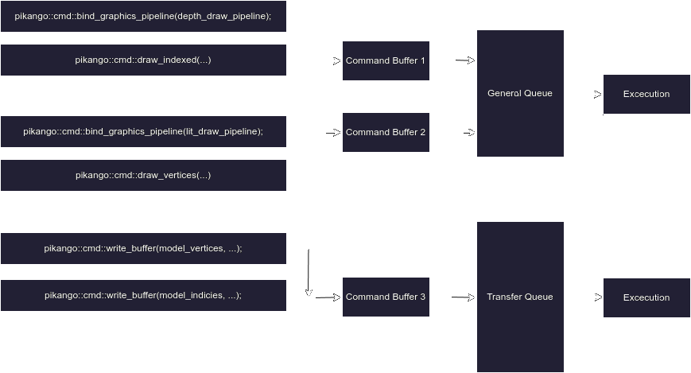

# Core Architecture Concepts

- **Library State**, is a collective term for all the states hidden in the library implemetation
- **Resource** is any ``x`` that can be created with ``pikango::new_x`` function
- **Handle** is pikango' alternative of ``std::shared_ptr``. It automatically releases handled resource when last handle pointing to the resource goes out of scope, or gets empty due to ``handle::~handle()`` call.
- **Queue** is an object to which **command buffers** can be **submited**, causing their later **execution**
- **Command Buffer** is a type of resource to which **commands** can be **recorded**
- **Command** is a type of pikango function. Commands instead of executing right after being called on the cpu **record** themselfs into the current **command buffer**, and execute during this buffer **execution**.

# General Graphics Concepts

- **Buffer** is a type of resource, representing block of memory on the GPU.
    - **Vertex Buffer** is type of buffer for storing verticies
    - **Index Buffer** is type of buffer for storing indicies
    - **Instance Buffer** is type of buffer for storing *instances* attributes
    - **Uniform Buffer** is type of buffer for storing **shaders** uniforms
- **Texture** is a type of resource, representing block of memory on the GPU + information on how to *sample** it.
- **Frame Buffer** is a collection of ***textures** that can be used as a destination of rendering operation
- **Shader** is a resource representing a GPU program.
    - **Vertex Shader** is a type of shader for processing vertices
    - **Geometry Shader** is a type of shader for processing geometry
    - **Pixel Shader** is a type of shader for processing pixels 
- **Resource Descriptor** is a type of resource, referencing **buffers** and **textures** that should be used during rendering.

# Code Flow

## Blocking Functions
All pikango' functions inside ``pikango::`` namespace, are synchronous and perform their job right after being executed. 


## Commands
Above does not apply to the functions inside ``pikango::cmd::`` namespace.   
Instead those functions **record** themselves into the currently recorded **command buffer**.  

```cpp
//================================================================================================
//Record Command Buffer

auto command_buffer = pikango::new_command_buffer();

pikango::clear_command_buffer(command_buffer);
pikango::begin_command_buffer_recording(command_buffer);

pikango::cmd::set_viewport({0, 0, window_width, window_height});
pikango::cmd::set_scissors({0, 0, window_width, window_height});

pikango::cmd::bind_graphics_pipeline(pipeline);
pikango::cmd::bind_resources_descriptor(resources_descriptor, 0);
pikango::cmd::bind_vertex_buffer(vertices);
pikango::cmd::bind_index_buffer(indicies);
pikango::cmd::bind_frame_buffer(frame_buffer);

pikango::cmd::draw_indexed(pikango::draw_primitive::traingles, indicies_amount, 0, 0, 1, 0);

pikango::end_command_buffer_recording(command_buffer);
```

Later, when the buffer is **submited** to an **queue** all the recorded commands will execute in the order they were recorded.  



## Queues

Queues, are global FIFO objects, in which subbmited **command buffers** are stored, before getting executed.  

Pikango defines 3 queue types:
- general - for all kind of operations
- transfer - for transfering data to gpu, for instance streaming textures
- compute - for performing extra computations

To submit command buffer to the queue use ``pikango::submit_command_buffer``:

```cpp
pikango::submit_command_buffer_with_fence(command_buffer, pikango::queue_type::general);
```

Order of execution between queues is not definied.

# Thread-Safeness and Synchronising

Pikango must be synchronised externally. 
It is on the client program to ensure, that, for instance, a buffer is not written by a transfer thread while it is read by an drawing operation from general thread.

To synchronise program code, with queue you can also pass a **fence** object when submiting command buffer.  
Fence will be unactive until the submited command buffer gets executed.  
To wait fence activation use ``pikango::wait_fence()``.  

```cpp
//================================================================================================
//Render 
auto fence = pikango::new_fence();

pikango::submit_command_buffer_with_fence(command_buffer, pikango::queue_type::general, 0, fence);
pikango::wait_fence(fence);
```
